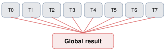
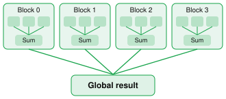

# Dot Product: 点积

> **题目来源**：[LeetGPU — Dot Product](https://leetgpu.com/challenges/dot-product) · **难度**：Medium · **语言**：CUDA C++  

## 题目描述

# Dot Product（向量点积）

- 难度：Medium
- 原题：https://leetgpu.com/challenges/dot-product

## 题目描述

使用 GPU 计算两个 FP32 向量的点积。对于长度为 N 的向量 A 和 B，结果为对应元素相乘后的总和：

$$
A \cdot B = \sum_{i=0}^{N-1} A_i B_i
$$

## 实现要求

- 使用 GPU 原生功能实现，不允许调用外部计算库。
- 不得修改 `solve` 函数签名。
- 将最终计算结果写入 `result` 指向的设备内存。

## CUDA 函数接口

```cpp
#include <cuda_runtime.h>

// A、B、result 均为 GPU 设备指针
extern "C" void solve(const float* A, const float* B, float* result, int N) {
    // 实现代码
}
```

## 示例 1

```text
输入：
A = [1.0, 2.0, 3.0, 4.0]
B = [5.0, 6.0, 7.0, 8.0]

输出：
result = 70.0
```

解释：1×5 + 2×6 + 3×7 + 4×8 = 70。

## 示例 2

```text
输入：
A = [0.5, 1.5, 2.5]
B = [2.0, 3.0, 4.0]

输出：
result = 15.5
```

解释：0.5×2 + 1.5×3 + 2.5×4 = 15.5。

## 约束条件

- 两个输入向量长度相等。
- `1 <= N <= 100000000`。
- 官方 GitHub 题目文件标注的性能测试规模为 `N = 5`。

---

## Naive

> Naive CUDA Kernel
> 让每个线程都计算属于自己下标的output

```cpp
#include <cuda_runtime.h>

__global__ void dot_product(const float* A, const float* B, float* result, int N) {
    int idx = blockDim.x * blockIdx.x + threadIdx.x;

    float t = 0.0;
    if (idx < N) {
        t = A[idx] * B[idx];
    }

    atomicAdd(result, t);
}

// A, B, result are device pointers
extern "C" void solve(const float* A, const float* B, float* result, int N) {
    int threads = 256;
    int blocks = (N + threads - 1) / threads;

    dot_product<<<blocks, threads>>>(A, B, result, N);
    cudaDeviceSynchronize();
}


```
---

## 优化: Shared Memory + Block Reduction
Naive实现有一个重大的问题: 所有 Thread 都对同一个全局内存地址执行原子加法，会产生严重的原子操作竞争（Atomic Contention）


优化思路如下:


```cpp

#include <cuda_runtime.h>

#define BLOCK_SIZE 256

__global__ void dot_product(
    const float* A,
    const float* B,
    float* result,
    int N
) {
    __shared__ float sdata[BLOCK_SIZE];

    int tid = threadIdx.x;
    int idx = blockIdx.x * blockDim.x + tid;
    int stride = blockDim.x * gridDim.x;

    // 1. 每个 Thread 负责多个元素
    float sum = 0.0f;

    for (int i = idx; i < N; i += stride) {
        sum += A[i] * B[i];
    }

    // 2. 将局部结果写入 Shared Memory
    sdata[tid] = sum;

    __syncthreads();

    // 3. Block 内并行归约
    for (int offset = blockDim.x / 2;
         offset > 0;
         offset >>= 1) {

        if (tid < offset) {
            sdata[tid] += sdata[tid + offset];
        }

        __syncthreads();
    }

    // 4. 每个 Block 只写一次
    if (tid == 0) {
        if (gridDim.x == 1) {
            result[0] = sdata[0];
        } else {
            atomicAdd(result, sdata[0]);
        }
    }
}

extern "C" void solve(
    const float* A,
    const float* B,
    float* result,
    int N
) {
    int threads = BLOCK_SIZE;

    int blocks = (N + threads - 1) / threads;

    // 限制 Block 数量，配合 Grid-Stride Loop
    if (blocks > 1024) {
        blocks = 1024;
    }

    // 多 Block 情况下，先初始化输出
    if (blocks > 1) {
        cudaMemset(result, 0, sizeof(float));
    }

    dot_product<<<blocks, threads>>>(A, B, result, N);

    cudaDeviceSynchronize();
}


```
