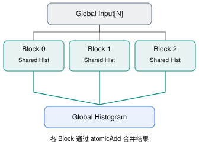

# 2D Convolution: 二维卷积

> **题目来源**：[LeetGPU — Histogramming](https://leetgpu.com/challenges/histogramming) · **难度**：Medium · **语言**：CUDA C++  

## 题目描述

使用 GPU 实现一个直方图统计程序。

给定包含 `N` 个 32 位整数的数组 `input`，以及直方图桶数 `num_bins`，统计每个整数在数组中出现的次数。

输入元素的取值范围为 `[0, num_bins)`。输出为长度为 `num_bins` 的整型数组 `histogram`，其中 `histogram[i]` 表示整数 `i` 在输入数组中出现的次数。

数学表达式：

$$
histogram[b] = \sum_{i=0}^{N-1} \mathbf{1}(input[i] = b), \quad 0 \le b < num\_bins
$$

其中，$\mathbf{1}(\cdot)$ 为指示函数，条件成立时取 1，否则取 0。

## 实现要求

- 仅使用原生 GPU 编程功能，不允许依赖外部库完成计算。
- 不得修改 `solve` 函数的签名。
- 计算结果必须写入输出数组 `histogram`。

## 示例

### 示例 1

```text
Input:
input = [0, 1, 2, 1, 0]
N = 5
num_bins = 3

Output:
histogram = [2, 2, 1]
```

### 示例 2

```text
Input:
input = [3, 3, 3, 3]
N = 4
num_bins = 5

Output:
histogram = [0, 0, 0, 4, 0]
```

## 约束条件

- `1 <= N <= 100000000`
- `0 <= input[i] < num_bins`
- `1 <= num_bins <= 1024`
- 输入元素为 32 位整数。
- 性能测试规模：`N = 50000000`，`num_bins = 256`。

## CUDA 函数接口

```cpp
#include <cuda_runtime.h>

extern "C" void solve(const int* input, int* histogram, int N, int num_bins) {
    // 在这里实现 CUDA 直方图统计
}
```

---

## Naive

> Naive CUDA Kernel
> 让每个线程都计算属于自己下标的histogram

```cpp
#include <cuda_runtime.h>

__global__ void histogramming(const int* input, int* histogram, int N, int num_bins) {
    int idx = blockDim.x * blockIdx.x + threadIdx.x;

    if (idx < num_bins) {
        histogram[idx] = 0;
    }

    // num_bins <= 1000 所以这里可以用
    __syncthreads();

    if (idx < N && input[idx] < num_bins) {
        atomicAdd(&histogram[input[idx]], 1);
    }
}

// input, histogram are device pointers
extern "C" void solve(const int* input, int* histogram, int N, int num_bins) {
    int threadNums = 1024;
    int blockPerGrid = (N + threadNums - 1) / threadNums;

    histogramming<<<blockPerGrid, threadNums>>>(input, histogram, N, num_bins);
    cudaDeviceSynchronize();
}


```
---

## 优化: Shared Memory 局部直方图
假如 N = 50,000,000，则需要执行：
5,000 万次 Global Memory AtomicAdd
多个线程访问相同桶时会产生原子操作竞争，导致性能下降.

CUDA Histogram 的经典优化，就是让每个 Block 独立维护一份 Histogram.



```cpp

#include <cuda_runtime.h>

__global__ void histogramming(
    const int* input,
    int* histogram,
    int N,
    int num_bins
) {
    // 每个 Block 私有的共享内存直方图
    extern __shared__ int local_hist[];

    int tid = threadIdx.x;
    int idx = blockIdx.x * blockDim.x + tid;

    // 1. 初始化共享内存
    for (int i = tid; i < num_bins; i += blockDim.x) {
        local_hist[i] = 0;
    }

    __syncthreads();

    // 2. 每个 Block 统计自己负责的数据
    int stride = blockDim.x * gridDim.x;

    for (int i = idx; i < N; i += stride) {
        int value = input[i];

        atomicAdd(&local_hist[value], 1);
    }

    __syncthreads();

    // 3. 合并局部 Histogram 到全局 Histogram
    for (int i = tid; i < num_bins; i += blockDim.x) {
        int count = local_hist[i];

        if (count > 0) {
            atomicAdd(&histogram[i], count);
        }
    }
}

// input, histogram are device pointers
extern "C" void solve(
    const int* input,
    int* histogram,
    int N,
    int num_bins
) {
    cudaMemset(histogram, 0, num_bins * sizeof(int));

    int threads = 256;

    int blocks = (N + threads - 1) / threads;

    // 控制 Block 数量，减少最终合并开销
    if (blocks > 1024) {
        blocks = 1024;
    }

    size_t shared_size = num_bins * sizeof(int);

    histogramming<<<blocks, threads, shared_size>>>(
        input,
        histogram,
        N,
        num_bins
    );

    cudaDeviceSynchronize();
}


```