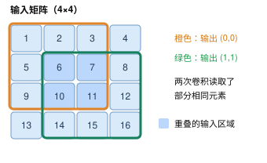
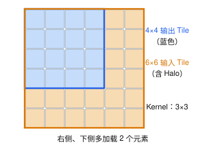

# 2D Convolution: 二维卷积

> **题目来源**：[LeetGPU — 2D Convolution](https://leetgpu.com/challenges/2d-convolution) · **难度**：Medium · **语言**：CUDA C++  

## 题目描述

使用 GPU 实现二维卷积计算。给定输入矩阵 `input` 和卷积核 `kernel`，计算二者的 valid 卷积结果。

- 不添加 Padding（填充）。
- 卷积核移动步长为 1。
- 只有卷积核完全处于输入矩阵范围内时才计算输出。
- 所有数据均为 32 位浮点数（float32）。
- 输入矩阵和卷积核都以行优先（Row-major）方式展平为一维数组。

### 输入

- `input`：尺寸为 `input_rows × input_cols` 的矩阵。
- `kernel`：尺寸为 `kernel_rows × kernel_cols` 的卷积核。

### 输出尺寸

```text
output_rows = input_rows - kernel_rows + 1
output_cols = input_cols - kernel_cols + 1
```

### 计算公式

$$
output[i][j] =
\sum_{m=0}^{kernel\_rows-1}
\sum_{n=0}^{kernel\_cols-1}
input[i+m][j+n] \cdot kernel[m][n]
$$

## 实现要求

- 使用 GPU 完成计算，不使用外部计算库。
- 保持题目提供的 `solve` 函数接口不变。
- 将计算结果写入 `output` 数组。

## 示例 1

**输入：**

```text
input (3×3):
[[1, 2, 3],
 [4, 5, 6],
 [7, 8, 9]]

kernel (2×2):
[[0, 1],
 [1, 0]]
```

**输出：**

```text
output (2×2):
[[ 6,  8],
 [12, 14]]
```

## 示例 2

**输入：**

```text
input (4×4):
[[1, 1, 1, 1],
 [1, 2, 3, 1],
 [1, 4, 5, 1],
 [1, 1, 1, 1]]

kernel (1×3):
[[1, 0, 1]]
```

**输出：**

```text
output (4×2):
[[2, 2],
 [4, 3],
 [6, 5],
 [2, 2]]
```

## 约束条件

- `1 <= input_rows, input_cols <= 3072`
- `1 <= kernel_rows, kernel_cols <= 31`
- `kernel_rows <= input_rows`
- `kernel_cols <= input_cols`

## 性能测试

- 输入矩阵尺寸：`3072 × 3072`
- 卷积核尺寸：`15 × 15`

---

## Naive

> Naive CUDA Kernel
> 让每个线程都计算属于自己下标的output

```cpp
#include <cuda_runtime.h>

__global__ void convolution(const float* input, const float* kernel, float* output, int input_rows,
                      int input_cols, int kernel_rows, int kernel_cols) {
    int output_rows = input_rows - kernel_rows + 1;
    int output_cols = input_cols - kernel_cols + 1;
    int id = blockDim.x * blockIdx.x + threadIdx.x;
    if (id >= output_rows * output_cols) {
        return ;
    }
    int i = id / output_cols;
    int j = id - i * output_cols;
    float t = 0;
    for (int m = 0; m < kernel_rows; ++m) {
        for  (int n = 0; n < kernel_cols; ++n) {
            t += input[(i + m) * input_cols + j + n] * kernel[m * kernel_cols + n];
        }
    }
    output[id] = t;
}

// input, kernel, output are device pointers
extern "C" void solve(const float* input, const float* kernel, float* output, int input_rows,
                      int input_cols, int kernel_rows, int kernel_cols) {
    int output_rows = input_rows - kernel_rows + 1;
    int output_cols = input_cols - kernel_cols + 1;
    int threadsPerBlock = 256;
    int blocksPerGrid = (output_rows * output_cols + threadsPerBlock - 1) / threadsPerBlock;
    convolution<<<blocksPerGrid, threadsPerBlock>>>(input, kernel, output,
                                                    input_rows, input_cols, kernel_rows,
                                                    kernel_cols);
    cudaDeviceSynchronize();
}


```
---

## 优化: Shared Memory + Tiling
Naive实现最大的问题是相邻线程会反复读取重叠的输入区域，所以可以使用 Shared Memory + Tiling（分块计算）减少重复的全局内存访问.

考虑一个 3×3 的卷积核，以及 4×4 的输入矩阵。

假设一个 Block 负责计算 16×16 个输出元素。
对于 3×3 的卷积核：
- 朴素计算：逻辑上需要执行 16 × 16 × 3 × 3 = 2304 次输入读取。
- 使用 Shared Memory：只需要先读取一个 18×18 = 324 元素的输入 Tile，然后在共享内存中复用。
注意，这里比较的是输入读取指令数量与 Tile 预加载数量，而不是实际 HBM 访问次数。

```cpp

#include <cuda_runtime.h>

#define TILE 16

__global__ void convolution_shared(
    const float* __restrict__ input,
    const float* __restrict__ kernel,
    float* __restrict__ output,
    int input_rows,
    int input_cols,
    int kernel_rows,
    int kernel_cols
) {
    extern __shared__ float s_input[];

    int output_rows = input_rows - kernel_rows + 1;
    int output_cols = input_cols - kernel_cols + 1;

    int tx = threadIdx.x;
    int ty = threadIdx.y;

    int x = blockIdx.x * TILE + tx;
    int y = blockIdx.y * TILE + ty;

    // 包含 Halo 的共享内存区域
    int shared_width = TILE + kernel_cols - 1;
    int shared_height = TILE + kernel_rows - 1;

    int tid = ty * TILE + tx;
    int total_threads = TILE * TILE;

    // 每个线程加载一个或多个输入元素
    for (int idx = tid;
         idx < shared_width * shared_height;
         idx += total_threads) {

        int sy = idx / shared_width;
        int sx = idx % shared_width;

        int global_y = blockIdx.y * TILE + sy;
        int global_x = blockIdx.x * TILE + sx;

        float value = 0.0f;

        if (global_y < input_rows &&
            global_x < input_cols) {

            value = input[global_y * input_cols
                          + global_x];
        }

        s_input[idx] = value;
    }

    // 等待 Block 内所有线程加载完成
    __syncthreads();

    if (x >= output_cols || y >= output_rows) {
        return;
    }

    float sum = 0.0f;

    for (int m = 0; m < kernel_rows; ++m) {
        for (int n = 0; n < kernel_cols; ++n) {

            float a = s_input[
                (ty + m) * shared_width + tx + n
            ];

            float b = kernel[m * kernel_cols + n];

            sum = fmaf(a, b, sum);
        }
    }

    output[y * output_cols + x] = sum;
}

extern "C" void solve(
    const float* input,
    const float* kernel,
    float* output,
    int input_rows,
    int input_cols,
    int kernel_rows,
    int kernel_cols
) {
    int output_rows = input_rows - kernel_rows + 1;
    int output_cols = input_cols - kernel_cols + 1;

    dim3 block(TILE, TILE);

    dim3 grid(
        (output_cols + TILE - 1) / TILE,
        (output_rows + TILE - 1) / TILE
    );

    size_t shared_bytes =
        (TILE + kernel_rows - 1) *
        (TILE + kernel_cols - 1) *
        sizeof(float);

    convolution_shared<<<grid, block, shared_bytes>>>(
        input,
        kernel,
        output,
        input_rows,
        input_cols,
        kernel_rows,
        kernel_cols
    );
}


```

## 为什么需要Halo

示意：为计算一个 4×4 的输出 Tile，3×3 卷积必须读取 6×6 的输入区域。
通用公式是：
\[
H_{\text{shared}}=H_{\text{tile}}+K_h-1
\]

\[
W_{\text{shared}}=W_{\text{tile}}+K_w-1
\]