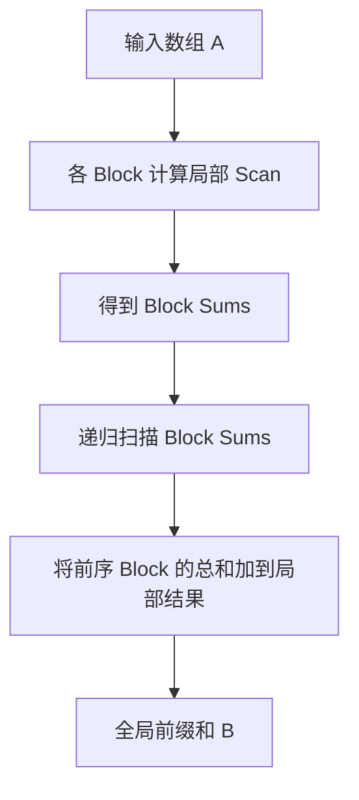

# Prefix Sum：CUDA 并行前缀和

> **题目来源**：[LeetGPU — Prefix Sum](https://leetgpu.com/challenges/prefix-sum) · **难度**：Medium · **语言**：CUDA C++  

## 题目描述

给定一个长度为 `N` 的 `float32` 数组 `A`，在 GPU 上计算**包含当前位置的前缀和（Inclusive Prefix Sum）**，并将结果存入 `B`。

$$
B_i = \sum_{j=0}^{i} A_j, \qquad 0 \le i < N
$$

例如（自拟示例）：

```text
A = [2.0, -1.0, 4.0, 3.0]
B = [2.0,  1.0, 5.0, 8.0]
```

**题目要点**（详见[原题](https://leetgpu.com/challenges/prefix-sum)）：

- `1 ≤ N ≤ 100,000,000`；元素范围为 `[-1000, 1000]`。
- 结果用 `float32` 存储；评测重点规模为 `N = 250,000`。
- 需要使用 GPU 原生能力实现，不调用外部扫描库；保持平台要求的 `solve` 签名并写入输出数组。

这里计算的是 **Inclusive Scan**，不是 Exclusive Scan：前者 `B[0] = A[0]`，后者通常 `B[0] = 0`。

---

## Naive

> Naive CUDA Kernel
> 让每个线程都计算属于自己下标的前缀和

```cpp
#include <cuda_runtime.h>

__global__ void prefix_sum_kernel(const float* A, float* B, int total) {
    int id = blockDim.x * blockIdx.x + threadIdx.x;
    if (id < total) {
        float sum = 0.0;
        for (int i = 0; i <= id; ++i) {
            sum += A[i];
        }
        B[id] = sum;
    }
}

extern "C" void solve(const float* A, float* B, int N) {
    int total = N;
    int threadsPerBlock = 256;
    int blocksPerGrid = (total + threadsPerBlock - 1) / threadsPerBlock;
    prefix_sum_kernel<<<blocksPerGrid, threadsPerBlock>>>(A, B, total);
    cudaDeviceSynchronize();
}

```

## 参考实现：分层并行 Scan

单个 `Block` 内可以使用 `__shfl_up_sync` 和少量 Shared Memory 做前缀和，但**不同 Block 之间不能用 `__syncthreads()` 同步**。

因此采用递归的分块方案：

1. 每个 Block 计算自己的局部前缀和，同时写出该 Block 的总和。
2. 对所有 Block 总和再次执行前缀和（数据太长就继续分层）。
3. 将此前所有 Block 的总和，加到当前 Block 的每个局部结果中。



下面的代码是一份便于理解的 CUDA 参考实现。使用了 256 线程/Block、Warp Shuffle、Shared Memory 以及递归的 Kernel 调用：

```cpp
#include <cuda_runtime.h>

constexpr int BLOCK = 256;

// 第一阶段：每个 Block 独立计算局部 Inclusive Scan
__global__ void block_scan(
    const float* A,
    float* B,
    float* block_sums,
    int N
) {
    __shared__ float s[BLOCK];

    int t = threadIdx.x;
    int id = blockIdx.x * BLOCK + t;

    float v = (id < N) ? A[id] : 0.0f;
    s[t] = v;
    __syncthreads();

    // Upsweep：归约树，计算各级区间和
    // 开始二叉规约树, 一共log2(N)次循环
    for (int offset = 1; offset < BLOCK; offset *= 2) {
        // 等差数列公式推导
        int idx = (t + 1) * 2 * offset - 1;

        if (idx < BLOCK)
            s[idx] += s[idx - offset];

        __syncthreads();
    }

    // 保存当前 Block 的总和
    if (t == 0) {
        if (block_sums != nullptr)
            block_sums[blockIdx.x] = s[BLOCK - 1];

        s[BLOCK - 1] = 0.0f;
    }
    __syncthreads();

    // Downsweep：构造 Exclusive Scan
    for (int offset = BLOCK / 2; offset > 0; offset /= 2) {
        int idx = (t + 1) * 2 * offset - 1;

        if (idx < BLOCK) {
            float tmp = s[idx - offset];
            s[idx - offset] = s[idx];
            s[idx] += tmp;
        }

        __syncthreads();
    }

    // Exclusive -> Inclusive
    if (id < N)
        B[id] = s[t] + v;
}

// 第三阶段：加上之前所有 Block 的总和
__global__ void add_offsets(
    float* B,
    const float* scanned_sums,
    int N
) {
    int id = blockIdx.x * BLOCK + threadIdx.x;

    if (id < N && blockIdx.x > 0) {
        B[id] += scanned_sums[blockIdx.x - 1];
    }
}

// 递归处理任意长度的数组
void hierarchical_scan(
    const float* A,
    float* B,
    int N
) {
    if (N <= 0) return;

    int num_blocks = (N + BLOCK - 1) / BLOCK;

    float* block_sums = nullptr;
    float* scanned_sums = nullptr;

    if (num_blocks > 1) {
        cudaMalloc(&block_sums, num_blocks * sizeof(float));
        cudaMalloc(&scanned_sums, num_blocks * sizeof(float));
    }

    // 第一阶段：局部 Scan
    block_scan<<<num_blocks, BLOCK>>>(
        A, B, block_sums, N
    );

    if (num_blocks > 1) {
        // 第二阶段：递归扫描各 Block 的和
        hierarchical_scan(
            block_sums, scanned_sums, num_blocks
        );

        // 第三阶段：添加全局偏移
        add_offsets<<<num_blocks, BLOCK>>>(
            B, scanned_sums, N
        );

        cudaFree(block_sums);
        cudaFree(scanned_sums);
    }
}

extern "C" void solve(const float* A, float* B, int N) {
    hierarchical_scan(A, B, N);
    cudaDeviceSynchronize();
}
```


## 本题收获

Prefix Sum 不能简单地“一个线程处理一个输出”，因为每个输出都依赖它前面的输入。核心是把这个依赖结构改写为可以并行执行的 **Scan**，并在 **Warp → Block → Grid** 的层次之间传递局部总和。

下一次优化可以重点比较：**朴素 Shared Memory Scan、Warp Shuffle Scan、减少 Launch 的算法**，并记录同一测试环境中的实测延迟。
