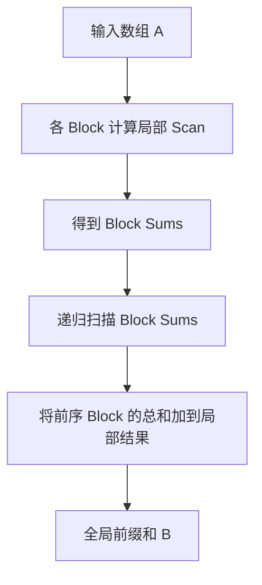

> **题目来源**：[LeetGPU — Prefix Sum](https://leetgpu.com/challenges/prefix-sum) · **难度**：Medium · **语言**：CUDA C++  

## 1. 题目描述

给定一个长度为 `N` 的 `float32` 数组 `A`，在 GPU 上计算**包含当前位置的前缀和（Inclusive Prefix Sum）**，并将结果存入 `B`。

$$
B_i = \sum_{j=0}^{i} A_j, \qquad 0 \le i < N
$$

例如（自拟示例）：

```text
A = [2.0, -1.0, 4.0, 3.0]
B = [2.0,  1.0, 5.0, 8.0]
```

**题目要点**（详见[原题](https://leetgpu.com/challenges/prefix-sum)）：

- `1 ≤ N ≤ 100,000,000`；元素范围为 `[-1000, 1000]`。
- 结果用 `float32` 存储；评测重点规模为 `N = 250,000`。
- 需要使用 GPU 原生能力实现，不调用外部扫描库；保持平台要求的 `solve` 签名并写入输出数组。

这里计算的是 **Inclusive Scan**，不是 Exclusive Scan：前者 `B[0] = A[0]`，后者通常 `B[0] = 0`。

## 2. Naive

> Naive CUDA Kernel
> 让每个线程都计算属于自己下标的前缀和

```cpp
#include <cuda_runtime.h>

__global__ void prefix_sum_kernel(const float* A, float* B, int total) {
    int id = blockDim.x * blockIdx.x + threadIdx.x;
    if (id < total) {
        float sum = 0.0;
        for (int i = 0; i <= id; ++i) {
            sum += A[i];
        }
        B[id] = sum;
    }
}

extern "C" void solve(const float* A, float* B, int N) {
    int total = N;
    int threadsPerBlock = 256;
    int blocksPerGrid = (total + threadsPerBlock - 1) / threadsPerBlock;
    prefix_sum_kernel<<<blocksPerGrid, threadsPerBlock>>>(A, B, total);
    cudaDeviceSynchronize();
}

```

## 3. 参考实现：分层并行 Scan

单个 `Block` 内可以使用 `__shfl_up_sync` 和少量 Shared Memory 做前缀和，但**不同 Block 之间不能用 `__syncthreads()` 同步**。

因此采用递归的分块方案：

1. 每个 Block 计算自己的局部前缀和，同时写出该 Block 的总和。
2. 对所有 Block 总和再次执行前缀和（数据太长就继续分层）。
3. 将此前所有 Block 的总和，加到当前 Block 的每个局部结果中。



下面的代码是一份便于理解的 CUDA 参考实现。使用了 256 线程/Block、Warp Shuffle、Shared Memory 以及递归的 Kernel 调用：

```cpp
#include <cuda_runtime.h>

constexpr int BLOCK = 256;
constexpr int WARP = 32;
constexpr int WARPS_PER_BLOCK = BLOCK / WARP;

// 一个 Warp 内的 Inclusive Scan：5 轮 Shuffle。
__device__ __forceinline__ float warp_scan(float value) {
    const int lane = threadIdx.x & (WARP - 1);
    for (int offset = 1; offset < WARP; offset <<= 1) {
        const float prev = __shfl_up_sync(0xffffffffu, value, offset);
        if (lane >= offset) value += prev;
    }
    return value;
}

// 每个 Block 扫描 256 个元素，并可选地记录该 Block 的总和。
__global__ void block_scan(const float* input,
                           float* output,
                           float* block_sums,
                           int n) {
    __shared__ float warp_sums[WARPS_PER_BLOCK];

    const int tid = threadIdx.x;
    const int lane = tid & (WARP - 1);
    const int warp = tid / WARP;
    const int idx = blockIdx.x * BLOCK + tid;

    // 处理最后不足 256 元素的 Block：越界位置填 0。
    float value = (idx < n) ? input[idx] : 0.0f;

    // 阶段 1：Warp 内 Inclusive Scan。
    value = warp_scan(value);

    // 每个 Warp 的末线程将 Warp 总和写入共享内存。
    if (lane == WARP - 1) warp_sums[warp] = value;
    __syncthreads();

    // 阶段 2：第一个 Warp 对 8 个 Warp 总和做 Scan。
    if (warp == 0) {
        float sum = (lane < WARPS_PER_BLOCK) ? warp_sums[lane] : 0.0f;
        sum = warp_scan(sum);
        if (lane < WARPS_PER_BLOCK) warp_sums[lane] = sum;
    }
    __syncthreads();

    // 阶段 3：叠加前面所有 Warp 的总和。
    if (warp > 0) value += warp_sums[warp - 1];

    if (idx < n) output[idx] = value;

    // tid=255 的值等于整个 Block（包括填零位置）的总和。
    if (block_sums != nullptr && tid == BLOCK - 1) {
        block_sums[blockIdx.x] = value;
    }
}

// block_offsets 为 Block 总和的 Inclusive Scan。
// 第 b 个 Block 要叠加的是 block_offsets[b-1]。
__global__ void add_offsets(float* output,
                            const float* block_offsets,
                            int n) {
    const int idx = blockIdx.x * BLOCK + threadIdx.x;
    if (blockIdx.x > 0 && idx < n) {
        output[idx] += block_offsets[blockIdx.x - 1];
    }
}

// 在 Host 端递归组织多个 Kernel Launch。
void recursive_scan(const float* input, float* output, int n) {
    const int num_blocks = (n + BLOCK - 1) / BLOCK;

    float* block_sums = nullptr;
    float* scanned_sums = nullptr;

    if (num_blocks > 1) {
        cudaMalloc(reinterpret_cast<void**>(&block_sums),
                   static_cast<size_t>(num_blocks) * sizeof(float));
    }

    block_scan<<<num_blocks, BLOCK>>>(input, output, block_sums, n);

    if (num_blocks > 1) {
        cudaMalloc(reinterpret_cast<void**>(&scanned_sums),
                   static_cast<size_t>(num_blocks) * sizeof(float));

        recursive_scan(block_sums, scanned_sums, num_blocks);

        add_offsets<<<num_blocks, BLOCK>>>(output, scanned_sums, n);

        cudaFree(scanned_sums);
        cudaFree(block_sums);
    }
}

// A、B 均为 GPU Device Pointer。若平台提供不同参数名，以平台签名为准。
extern "C" void solve(const float* A, float* B, int N) {
    if (N <= 0) return;
    recursive_scan(A, B, N);
    cudaDeviceSynchronize();
}
```

> **实现说明**：为了突出算法流程，这份代码省略了 CUDA API 返回值检查与内存池优化；`cudaMalloc/cudaFree` 和末尾同步都会带来性能开销。实际提交前请按平台提供的签名编译、测试并记录测量结果。


## 6. 本题收获

Prefix Sum 不能简单地“一个线程处理一个输出”，因为每个输出都依赖它前面的输入。核心是把这个依赖结构改写为可以并行执行的 **Scan**，并在 **Warp → Block → Grid** 的层次之间传递局部总和。

下一次优化可以重点比较：**朴素 Shared Memory Scan、Warp Shuffle Scan、减少 Launch 的算法**，并记录同一测试环境中的实测延迟。
