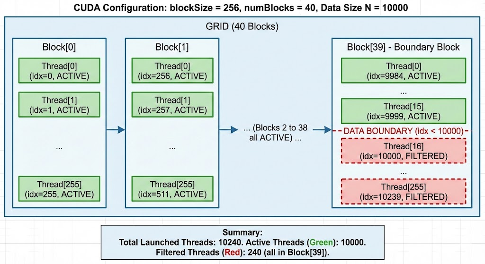
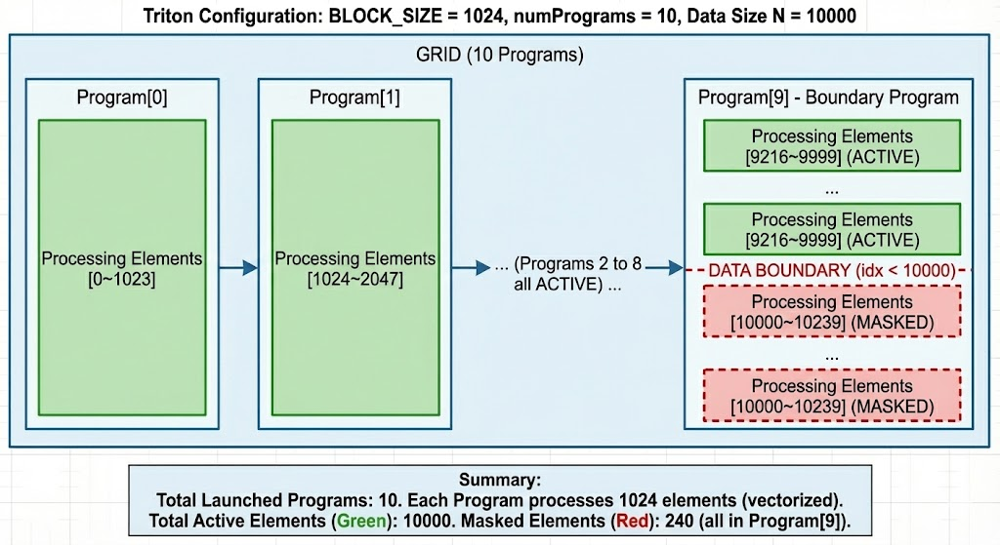

# Triton 编程范式入门
> 此文档摘抄于 [CUDATutorial](https://cuda.keter.top/triton/triton_programming_paradigms/)  , 通过CUDA vs Triton的模式, 快速理解Triton的编程范式.

---

## 从向量加法看两种编程范式
> 向量加法是最简单的并行任务，非常适合用来对比 CUDA 和 Triton 的编程思想差异.

### 任务描述
给定两个长度为 N 的向量 x 和 y，计算 out[i] = x[i] + y[i]，输出新的向量 out。这是一个典型的 element-wise 操作，每个输出元素的计算都是独立的，天然适合并行化.

### CUDA实现: 线程级并行
```cpp
__global__ void vector_add_cuda(float *x, float *y, float *out, int n) {
    // 每个线程计算自己的全局索引
    int idx = blockIdx.x * blockDim.x + threadIdx.x;

    // 边界检查
    if (idx < n) {
        out[idx] = x[idx] + y[idx];  // 每个线程处理一个元素
    }
}

int main() {
    int N = 10000000;
    // ... 省略内存分配和数据初始化 ...
    
    int blockSize = 256;  // 每个 Block 有 256 个线程
    int numBlocks = (N + blockSize - 1) / blockSize;
    
    vector_add_cuda<<<numBlocks, blockSize>>>(cuda_x, cuda_y, cuda_out, N);
    cudaDeviceSynchronize();
    
    return 0;
}
```

在 CUDA 的编程模型中，你需要`将任务分解到每一个线程。每个线程就像一个独立的工人`，负责处理一个元素。线程通过 blockIdx 和 threadIdx 这两个内置变量计算出自己负责的全局索引 idx，然后访问对应位置的数据。由于数组长度 n 可能不是 Block 大小的整数倍，我们需要用 if (idx < n) 来做边界检查，但这可能导致 Warp Divergence，影响性能.

### Triton实现: 数据块级并行
> 在 Triton 中，你需要思考：`每个 Program Instance 处理哪批元素`

```python
import torch
import triton
import triton.language as tl

@triton.jit
def vector_add_triton(
    x_ptr,                      # 输入向量 x 的指针
    y_ptr,                      # 输入向量 y 的指针
    out_ptr,                    # 输出向量 out 的指针
    n_elements,                 # 向量长度
    BLOCK_SIZE: tl.constexpr,   # 每个 Program 处理的元素数（编译时常量）
):
    # 1. 获取当前 Program 的 ID（类似 blockIdx.x）
    pid = tl.program_id(axis=0)
    
    # 2. 计算当前 Program 负责的元素范围
    block_start = pid * BLOCK_SIZE
    offsets = block_start + tl.arange(0, BLOCK_SIZE)
    # offsets 是一个向量！例如：[0, 1, 2, ..., BLOCK_SIZE-1]
    
    # 3. 创建边界检查的 mask（向量化的边界检查）
    mask = offsets < n_elements
    
    # 4. 向量化加载数据（一次加载 BLOCK_SIZE 个元素）
    x = tl.load(x_ptr + offsets, mask=mask)
    y = tl.load(y_ptr + offsets, mask=mask)
    
    # 5. 向量化计算
    out = x + y
    
    # 6. 向量化存储
    tl.store(out_ptr + offsets, out, mask=mask)


# Host 端调用
def add(x: torch.Tensor, y: torch.Tensor):
    assert x.is_cuda and y.is_cuda, "输入必须在 GPU 上"
    assert x.shape == y.shape, "输入形状必须一致"
    
    out = torch.empty_like(x)
    n_elements = out.numel()
    
    # 计算需要多少个 Program Instance
    grid = lambda meta: (triton.cdiv(n_elements, meta['BLOCK_SIZE']),)
    
    # 启动 Kernel
    vector_add_triton[grid](x, y, out, n_elements, BLOCK_SIZE=1024)
    
    return out


# 使用示例
if __name__ == "__main__":
    N = 10_000_000
    x = torch.randn(N, device='cuda', dtype=torch.float32)
    y = torch.randn(N, device='cuda', dtype=torch.float32)
    
    out = add(x, y)
    
    # 验证正确性(?), 这里调用的其实是torch.add, 类似于直接调用kernel进行加法, 而不是再CPU进行加法
    expected = x + y
    assert torch.allclose(out, expected), "结果不匹配！"
```

相比之下，Triton 的编程模型更像是把线程们组织成团队。`每个 Program Instance 处理一批元素`（BLOCK_SIZE 个），而不是单个元素。你通过 tl.arange 生成一个向量化的偏移量数组，这个数组包含了当前 Program 要处理的所有元素的索引。边界检查也变成了向量化的操作：mask = offsets < n_elements 会生成一个布尔向量，标记哪些位置是有效的。这种向量化的 mask 机制可以有效避免 Warp Divergence。实际上，Triton 中的所有操作都是向量化的（SIMD），这是它和 CUDA 最本质的区别.

## 核心概念对比

### 概念映射表
| CUDA 概念 | Triton 概念 | 说明 |
|:---:|:---:|:---:|
| `__global__` | `@triton.jit` | Kernel 函数标记 |
| Thread | 无直接对应的显式线程索引 | Triton 主要使用向量化编程 |
| Block | Program Instance | 近似对应的并行执行单元 |
| `blockIdx.x` | `tl.program_id(0)` | 获取当前 Program 的 ID |
| `blockIdx.y` | `tl.program_id(1)` | 获取第二维 Program ID |
| `threadIdx.x` | 无直接对应 | Triton 自动进行线程映射 |
| `blockDim.x` | `num_warps × 32`（常见情况） | CUDA 线程数量与 Triton Warp 配置的关系 |
| 每个 Block 处理的元素数 | `BLOCK_SIZE` | 每个 Program 逻辑上处理的元素数量 |
| `blockIdx.x * blockDim.x + threadIdx.x` | `pid * BLOCK_SIZE + tl.arange(0, BLOCK_SIZE)` | 全局索引计算 |
| `if (idx < n)` | `mask = offsets < n` | 边界检查 |
| `x[idx]` | `tl.load(x_ptr + offsets, mask=mask)` | 从显存加载数据 |
| `out[idx] = value` | `tl.store(out_ptr + offsets, value, mask=mask)` | 向显存写入数据 |
| `__syncthreads()` | 编译器自动处理常规依赖同步，必要时使用 `tl.debug_barrier()` | 同步机制不同 |

### 线程索引 vs 向量化偏移

#### CUDA: 标量索引
```cpp
// 每个线程计算自己的索引（标量）
int idx = blockIdx.x * blockDim.x + threadIdx.x;

// 访问一个元素
float val = x[idx];
```

#### Triton: 向量偏移
```python
# 每个 Program 计算一批偏移量（向量）
pid = tl.program_id(axis=0)
offsets = pid * BLOCK_SIZE + tl.arange(0, BLOCK_SIZE)

# 访问一批元素
x = tl.load(x_ptr + offsets, mask=mask)
```

> 所以在Triton中, 要转变思维"我是第 pid 号 Program，我处理第 [start, start+1, ..., start+BLOCK_SIZE-1] 批元素".这里最关键的区别在于，CUDA 的 idx 是一个标量（单个整数），而 Triton 的 offsets 是一个向量（整数数组）.

### 边界检查: if vs mask
#### CUDA
```cpp
if (idx < n) {
    out[idx] = x[idx] + y[idx];  // 可能导致 Warp Divergence
}
```
> 使用标量 if 的问题在于，同一个 Warp 内的 32 个线程可能会因为边界条件走不同的分支.比如在最后一个 Block 中，前面的线程满足 idx < n 继续执行，而后面的线程不满足条件被过滤掉。这种分支分歧（Divergence）会导致 Warp 内的线程无法同步执行，从而降低性能.

#### Triton
```python
mask = offsets < n_elements  # 向量化比较，生成布尔向量

x = tl.load(x_ptr + offsets, mask=mask)  # 只加载有效位置
out = x + y
tl.store(out_ptr + offsets, out, mask=mask)  # 只存储有效位置
```
> Triton 的 mask 机制则完全不同.mask = offsets < n_elements 是一个向量化的比较操作，会生成一个布尔向量。在 tl.load 和 tl.store 中使用 mask 时，编译器会生成 predicated instructions（带谓词的指令），这是 GPU 硬件原生支持的特性.每个线程都有独立的 predicate 寄存器，可以在不引起分支的情况下选择性地执行指令.这样既保证了正确性，又避免了 Warp Divergence，代码还更简洁.

### 示例对比
#### CUDA


#### Triton


---

## Grid配置对比

### CUDA
```cpp
int blockSize = 256;  // 每个 Block 有 256 个线程
int numBlocks = (n + blockSize - 1) / blockSize;  // 向上取整

my_kernel<<<numBlocks, blockSize>>>(args);
```
在 CUDA 中，你需要同时指定 numBlocks（有多少个 Block）和 blockSize（每个 Block 有多少个 Thread）.blockSize 的选择受到 SM 资源的限制，通常设置为 128/256/512.如果设置得太大，会因为寄存器和 Shared Memory 的限制导致 Occupancy 下降.

### Triton
```python
BLOCK_SIZE = 1024  # 每个 Program Instance 处理 1024 个元素

grid = lambda meta: (triton.cdiv(n_elements, meta['BLOCK_SIZE']),)

my_kernel[grid](args, BLOCK_SIZE=BLOCK_SIZE)
```
Triton 的 Grid 配置则简单得多，你只需要指定 BLOCK_SIZE（每个 Program 处理多少元素），Grid 的大小会通过 triton.cdiv(n, BLOCK_SIZE) 自动计算.这里有一个重要的概念需要澄清：Triton 的 BLOCK_SIZE 并不等同于 CUDA 的 blockDim.x.CUDA 的 blockDim.x 表示线程数，而 Triton 的 BLOCK_SIZE 表示元素数.Triton 编译器会根据你指定的 BLOCK_SIZE，自动选择合适的线程配置来映射这些元素.

根据经验，Triton 的 BLOCK_SIZE 通常设置为 1024/2048/4096，比 CUDA 的 blockDim 要大得多.建议从 1024 开始尝试，然后根据实际性能进行调整.